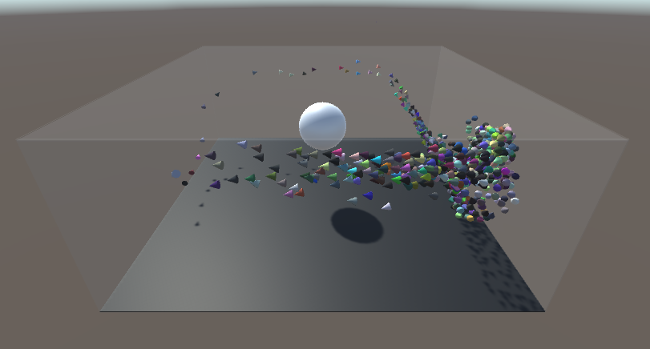

# Boids

A little experiment with boids in Unity based on the following video by [Sebastian Lague](https://github.com/SebLague/):  
https://www.youtube.com/watch?v=bqtqltqcQhw

## Motivations
This experiment takes place in the context of the AI & videogames course which is part of the Computer Science cursus of ENSEIRB-MATMECA engineer school.  

I wanted to understand how steering behaviors based on simple rules could simulate bird flocks in a very realistic way and I found this video by Sebastian Lague. I found it very interesting and I wanted to get a little bit deeper into the code to truly understand how these global behaviors were simulated.  
That is why I decided to clone the [repository](https://github.com/SebLague/Boids) containing the code of the video in order to read it, fully comment it and add some modifications to experiment the potential of these global behaviors based on simple individuals, that I will call boids in the following.

## Elements of the simulation

The projetc is composed of two scenes to experiment on the boids:
- the `Obstacles` scene is provided by the base project and consists in a transparent box to serve as a playground in which we can spawn boids and add obstacles that they must avoid or a target that they can follow.
- the `Circuit` scene was created by me and consists of a circular circuit in which we can spawn the boids and watch them follow the path.

Then, each scene uses several objects to handle the simulation of the boids:
- a *Boid* `prefab` which is composed of a cone object for the body of the boid and a `Boid` script which stocks the properties of the boid  

- a *Boid Manager* object with a script of the same name. The aim of this script is to handle the movement of all the boids of the scene through time. In order to do that it relies on:
  - a `List` stocking all the boids present on the scene.
  - a `BoidSettings` class which stocks all the settings shared by all the boids such as their minimal and maximal speed or the different weights used to simulate their behavior and which I will explain in the following.
  - a `ComputeShader` used to compute the boids attributes at each frame according to their neighbors boids.
  - a potential target `Transform` that the boids must follow.

- a *Spawner* object with a script of the same name which allows to spawn a chosen number of boids from the beginning of the simulation. I also added the possibility to spawn boids at the position of the mouse cursor when holding the *space* key down (the cursor must be positioned on a floor object).

## Behavior of the boids

As said previously, the behavior of the boids implemented in this experiment is based on very simple rules, described by this [paper](http://www.cs.toronto.edu/~dt/siggraph97-course/cwr87/) of Craig W. Reynolds. According to these rules, each boid must:
  1. have a limited vision radius which allows it to sense the nearby boids and obstacles
  2. steer away from nearby boids to avoid collisions
  3. steer to move in the global same direction of its neighbor boids
  4. steer towards the mean center of the neighbor boids to keep a flock cohesion
  5. steer to avoid obstacles
  6. steer towards a potential target

In order to compute the movement of the boids, it is necessary to compute the next position of each boid at each frame of the simulation. To do that the `BoidManager` uses the `ComputeShader` to compute informations for each boid about the others boids and obstacles that are present in their view radius. From these informations, the manager updates the attributes of each boid which one uses to update its velocity and direction accordingly in order to set its next position. The importance of each *steering* rule can be modified thanks to the steering weigths defined in the `BoidSettings` class. By modifying these weights at runtime we can experiment many different behaviors according to the higher weight values.
